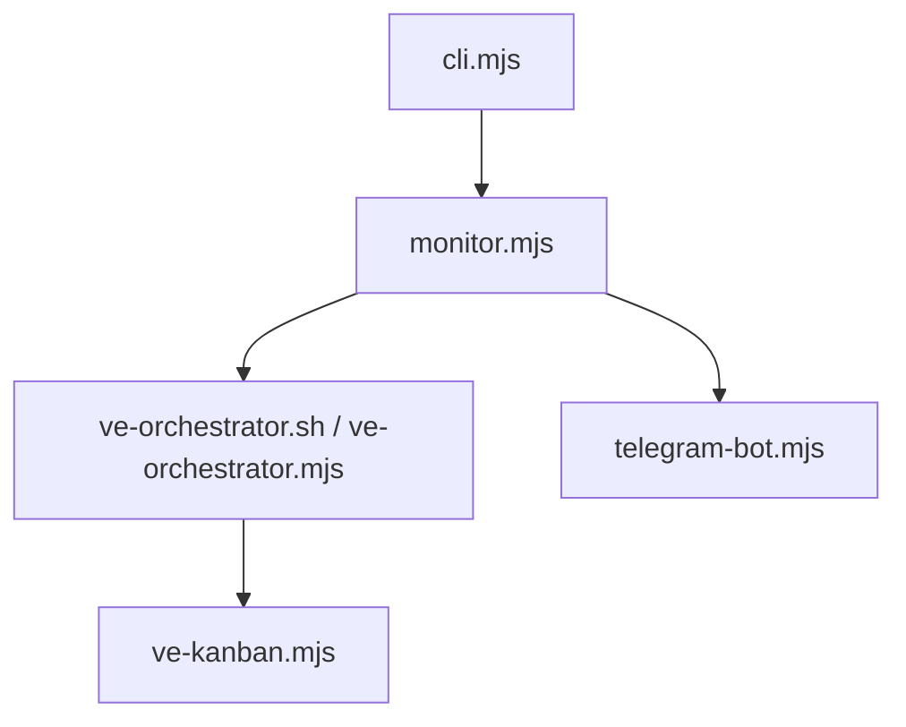

# Bosun — AGENTS Guide

## Module Overview

- Purpose: bosun supervises VirtEngine's autonomous coding fleet. It schedules task attempts, runs PR automation, self-heals failures, and reports status via Telegram.
- Use when: updating task orchestration, executor routing, VK API usage, or notification pipelines.
- Path mapping in this standalone repo: paths shown as scripts/bosun/... in older docs map to repo-root paths here (strip the scripts/bosun/ prefix when running commands).
- Key entry points:
  - CLI launcher: `scripts/bosun/cli.mjs:1`
  - Supervisor loop: `scripts/bosun/monitor.mjs:14`
  - Task runner: `scripts/bosun/ve-orchestrator.mjs:1`
  - VK API wrapper: `scripts/bosun/ve-kanban.mjs:1`
  - Telegram bot: `scripts/bosun/telegram-bot.mjs:1`
  - Telegram UI server: `scripts/bosun/ui-server.mjs:1`
  - Telegram Mini App UI: `scripts/bosun/ui/app.js:1`
  - Desktop portal launcher: `scripts/bosun/desktop/launch.mjs:1`
  - Desktop portal shell: `scripts/bosun/desktop/main.mjs:1`

## Architecture

- Entry points and data flow overview:
  - `cli.mjs` loads config and starts `monitor.mjs`.
  - `monitor.mjs` drives orchestration and delegates to `ve-orchestrator.sh`.
  - `ve-orchestrator.sh` runs `ve-orchestrator.mjs`, which submits/monitors attempts via `ve-kanban.mjs`.
  - `shared-state-manager.mjs` coordinates task claims across agents/workstations with heartbeat-based liveness.
- Component map (selected):
  | Component | Role | Key references |
  |---|---|---|
  | monitor.mjs | Supervisor loop, smart PR flow, maintenance scheduling, fleet sync | `scripts/bosun/monitor.mjs:4047` |
  | telegram-bot.mjs | Telegram polling, batching/live digest, command queueing | `scripts/bosun/telegram-bot.mjs:95` |
  | ve-orchestrator.mjs | Native task orchestration loop (parallel slots, retries, merge/archive checks, shared state integration) | `scripts/bosun/ve-orchestrator.mjs:1` |
  | ve-kanban.mjs | Native VK CLI wrapper (list/submit/rebase/archive attempts) | `scripts/bosun/ve-kanban.mjs:1` |
  | shared-state-manager.mjs | Distributed task claim coordination, heartbeat leasing, conflict resolution | `scripts/bosun/shared-state-manager.mjs:1` |
  | task-claims.mjs | Task claim persistence, conflict resolution, shared state delegation | `scripts/bosun/task-claims.mjs:1` |
  | sync-engine.mjs | Two-way kanban sync with shared state awareness | `scripts/bosun/sync-engine.mjs:1` |
  | fleet-coordinator.mjs | Multi-workstation coordination, fleet state persistence | `scripts/bosun/fleet-coordinator.mjs:181` |
  | autofix.mjs | Error loop detection + guarded auto-fix execution | `scripts/bosun/autofix.mjs:66` |
  | codex-shell.mjs | Persistent Codex SDK agent sessions | `scripts/bosun/codex-shell.mjs:1` |
  | copilot-shell.mjs | Persistent Copilot SDK agent sessions | `scripts/bosun/copilot-shell.mjs:1` |
  | config.mjs | Unified config loader (CLI/env/.env/json/defaults) | `scripts/bosun/config.mjs:4` |
  | hook-profiles.mjs | Setup-time multi-agent hook scaffolding (Codex/Claude/Copilot) | `scripts/bosun/hook-profiles.mjs:1` |
  | agent-hook-bridge.mjs | Bridges Claude/Copilot hook callbacks to bosun hook events | `scripts/bosun/agent-hook-bridge.mjs:1` |
  | github-app-auth.mjs | GitHub App JWT, installation tokens, OAuth, webhook verification | `scripts/bosun/github-app-auth.mjs:1` |
  | github-auth-manager.mjs | Unified auth manager: OAuth > App installation > gh CLI > env | `scripts/bosun/github-auth-manager.mjs:1` |
  | git-commit-helpers.mjs | Commit message & PR body helpers — Bosun Bot co-author credit | `scripts/bosun/git-commit-helpers.mjs:1` |



## Core Concepts

- Task lifecycle: create attempt, run agent, track PR status, complete task. References: `scripts/bosun/ve-orchestrator.mjs:1`, `scripts/bosun/ve-kanban.mjs:1`
- Smart PR flow: `smartPRFlow` handles rebases, PR creation, and merge decisions. References: `scripts/bosun/monitor.mjs:4047`
- Workspace management: worktrees are created and cleaned up via orchestration. References: `scripts/bosun/ve-orchestrator.ps1:3223`
- Error recovery: autofix patterns and circuit breakers prevent infinite loops. References: `scripts/bosun/autofix.mjs:66`, `scripts/bosun/monitor.mjs:400`
- State persistence: orchestrator and fleet state stored in `.cache`. References: `scripts/bosun/ve-orchestrator.ps1:144`, `scripts/bosun/fleet-coordinator.mjs:745`
- **Shared state model**: Distributed task coordination across agents/workstations. References: `scripts/bosun/shared-state-manager.mjs:1`
  - **Owner heartbeat**: Each claim has `ownerId` (workstation+agent) and `ownerHeartbeat` timestamp. Renewed periodically to prove liveness. References: `scripts/bosun/shared-state-manager.mjs:237`, `scripts/bosun/shared-state-manager.mjs:360`
  - **Attempt tokens**: Unique UUID per attempt for idempotent operations. References: `scripts/bosun/shared-state-manager.mjs:29`
  - **Retry/ignore flags**: `retryCount` tracks attempts, `ignoreReason` marks tasks agents should skip. References: `scripts/bosun/shared-state-manager.mjs:274`, `scripts/bosun/shared-state-manager.mjs:638`
  - **Conflict resolution**: Active heartbeat wins over stale claims (first-come-first-served if both active). References: `scripts/bosun/shared-state-manager.mjs:208`
  - **GitHub metadata persistence**: Uses `codex:` labels and structured comments for state tracking. References: `scripts/bosun/task-claims.mjs:540`
  - **Multi-agent coordination**: Prevents duplicate work via atomic claim operations, abandoned task recovery via stale sweeps. References: `scripts/bosun/shared-state-manager.mjs:524`, `scripts/bosun/ve-orchestrator.mjs:244`

## Usage Examples

### Start bosun with defaults

```bash
node cli.mjs
```

### Run the orchestrator loop

```bash
./scripts/bosun/ve-orchestrator.sh -MaxParallel 2 -PollIntervalSec 60
```

### Launch the desktop portal

```bash
node scripts/bosun/desktop/launch.mjs
```

### List todo tasks

```bash
./scripts/bosun/ve-kanban.sh list --status todo
```

### Run bosun tests

```bash
cd scripts/bosun
npm run test
```

### Enable/disable shared state

```bash
# Disable shared state coordination (default: enabled)
SHARED_STATE_ENABLED=false node cli.mjs

# Check if shared state is enabled
node -e "console.log(process.env.SHARED_STATE_ENABLED !== 'false')"
```

### Mark task as ignored for agents

```bash
node -e "
const { setIgnoreFlag } = require('./scripts/bosun/shared-state-manager.mjs');
await setIgnoreFlag('task-id-123', 'human_created');
"
```

### Check shared state for a task

```bash
node -e "
const { getSharedState } = require('./scripts/bosun/shared-state-manager.mjs');
const state = await getSharedState('task-id-123');
console.log(JSON.stringify(state, null, 2));
"
```

### Sweep stale states manually

```bash
node -e "
const { sweepStaleSharedStates } = require('./scripts/bosun/shared-state-manager.mjs');
const result = await sweepStaleSharedStates(300000); // 5 minutes
console.log('Swept', result.sweptCount, 'stale tasks');
"
```

## Implementation Patterns

- Adding a new executor:
  - Update executor parsing: `scripts/bosun/config.mjs:203`
  - Wire executor profiles in setup: `scripts/bosun/setup.mjs:1284`
  - Update cycling in `scripts/bosun/ve-kanban.ps1:41`
- Extending notification logic:
  - Adjust batching rules: `scripts/bosun/telegram-bot.mjs:95`
  - Ensure monitor emits notifications: `scripts/bosun/monitor.mjs:4047`
- Updating Telegram UI menus:
  - Add or adjust menu screens in `scripts/bosun/telegram-bot.mjs` (UI menu system).
- Updating the Telegram Mini App:
  - API endpoints: `scripts/bosun/ui-server.mjs:120`
  - UI views: `scripts/bosun/ui/app.js:1`, `scripts/bosun/ui/styles.css:1`
- Modifying PR flow behavior:
  - Update `smartPRFlow`: `scripts/bosun/monitor.mjs:4047`
- Adding new autofix patterns:
  - Extend signatures: `scripts/bosun/autofix.mjs:66`
- **Adding shared state to custom adapters**:
  - Claim task before work: `await claimTaskInSharedState(taskId, ownerId, attemptToken)`
  - Renew heartbeat during work: `await renewSharedStateHeartbeat(taskId, ownerId, attemptToken)` (every `SHARED_STATE_HEARTBEAT_INTERVAL_MS`)
  - Release on completion: `await releaseSharedState(taskId, attemptToken, 'complete'|'failed'|'abandoned')`
  - Check retry eligibility: `await shouldRetryTask(taskId, SHARED_STATE_MAX_RETRIES)`
  - References: `scripts/bosun/task-claims.mjs:540`, `scripts/bosun/ve-orchestrator.mjs:134`
- **Handling shared state failures gracefully**:
  - All shared state functions return `{success: boolean, reason?: string}` for claim/renew/release
  - On claim failure: check `reason` field (e.g., `"conflict: existing_owner_active"`)
  - On heartbeat renewal failure: agent should stop work and release claim
  - Fallback: If shared state is disabled/unavailable, local claims in `task-claims.mjs` still prevent same-workstation conflicts
  - References: `scripts/bosun/shared-state-manager.mjs:237`, `scripts/bosun/task-claims.mjs:540`
- **Debugging shared state conflicts**:
  - Enable verbose logging: `DEBUG=bosun:* node cli.mjs`
  - Check registry file: `.cache/bosun/shared-task-states.json`
  - View event log: `await getSharedState(taskId)` shows full event history (`eventLog` field)
  - Check staleness: Compare `ownerHeartbeat` against `SHARED_STATE_STALE_THRESHOLD_MS`
  - Manual intervention: `await setIgnoreFlag(taskId, reason)` to block future claims
  - References: `scripts/bosun/shared-state-manager.mjs:485`, `scripts/bosun/shared-state-manager.mjs:638`

## Configuration

- Config loading order: CLI -> env vars -> `.env` -> `bosun.config.json` -> defaults. Reference: `scripts/bosun/config.mjs:4`
- Required env vars:
  - Telegram: `TELEGRAM_BOT_TOKEN`, `TELEGRAM_CHAT_ID` (`scripts/bosun/.env.example:11`)
  - Vibe-Kanban: `VK_BASE_URL`, `VK_TARGET_BRANCH` (`scripts/bosun/.env.example:87`)
  - Executor routing: `EXECUTORS`, `EXECUTOR_DISTRIBUTION` (`scripts/bosun/.env.example:66`)
- VK workspace PATH propagation: `scripts/bosun/setup.mjs:487`

### Task-Context Environment Variables (injected by bosun)

When bosun launches an agent for a task it injects **both** naming conventions
so any agent instruction set (VirtEngine AGENTS.md, custom copilot-instructions,
vibe-kanban task files, etc.) can detect the Bosun context:

| Variable                 | Alias(es)                               | Value                                 |
| ------------------------ | --------------------------------------- | ------------------------------------- |
| `BOSUN_TASK_ID`          | `VE_TASK_ID`                            | Kanban task ID                        |
| `BOSUN_TASK_TITLE`       | `VE_TASK_TITLE`, `VK_TITLE`             | Task title                            |
| `BOSUN_TASK_DESCRIPTION` | `VE_TASK_DESCRIPTION`, `VK_DESCRIPTION` | Task description/body                 |
| `BOSUN_BRANCH_NAME`      | `VE_BRANCH_NAME`                        | Git branch for the task               |
| `BOSUN_WORKTREE_PATH`    | `VE_WORKTREE_PATH`                      | Absolute path to worktree             |
| `BOSUN_SDK`              | `VE_SDK`                                | SDK in use (codex / copilot / claude) |
| `BOSUN_MANAGED`          | `VE_MANAGED`                            | Always `"1"` inside a Bosun session   |

These are set in `scripts/bosun/task-executor.mjs` before `execWithRetry` and
are also forwarded to all hook subprocesses via `scripts/bosun/agent-hooks.mjs`.

**Safe instruction appending:** bosun only injects task context env vars and
appends a "Bosun Task Agent" section to the built-in prompt templates. It does
**not** override or clear any user-supplied `BOSUN_PROMPT_*` env vars or custom
`bosun.config.json` `agentPrompts` keys. If a user has a custom
`task-executor.md` in `.bosun/agents/` that file takes full precedence; bosun's
defaults only apply when no custom file exists. References:
`scripts/bosun/agent-prompts.mjs:resolveAgentPrompts`.

### Shared state configuration

- **Shared state configuration**:
  - `SHARED_STATE_ENABLED` (default: `true`) — Enable/disable distributed coordination (`scripts/bosun/.env.example:15`)
  - `SHARED_STATE_HEARTBEAT_INTERVAL_MS` (default: `60000` = 1 min) — How often to renew heartbeat (`scripts/bosun/.env.example:17`)
  - `SHARED_STATE_STALE_THRESHOLD_MS` (default: `300000` = 5 min) — When to consider heartbeat stale (`scripts/bosun/.env.example:20`)
  - `SHARED_STATE_MAX_RETRIES` (default: `3`) — Max attempts before ignoring task (`scripts/bosun/.env.example:22`)
  - `TASK_CLAIM_OWNER_STALE_TTL_MS` (default: `600000` = 10 min) — Local claim staleness threshold (`scripts/bosun/.env.example:24`)
  - References: `scripts/bosun/task-claims.mjs:58`, `scripts/bosun/sync-engine.mjs:42`, `scripts/bosun/ve-orchestrator.mjs:13`

## GitHub App (Bosun Bot)

Bosun has a GitHub App called **Bosun[VE]** (`bosun-ve[bot]`, user ID `262908237`).
App URL: https://github.com/apps/bosun-ve

### Authentication modules

| Module                    | Purpose                                                                  |
| ------------------------- | ------------------------------------------------------------------------ |
| `github-app-auth.mjs`     | Low-level: JWT signing, installation tokens, OAuth, webhook verification |
| `github-auth-manager.mjs` | High-level: unified token resolution with fallback chain                 |
| `git-commit-helpers.mjs`  | Commit message & PR body helpers with bot co-author credit               |

### Auth priority (github-auth-manager.mjs)

1. `~/.bosun/github-auth-state.json` OAuth user token (or `BOSUN_GITHUB_USER_TOKEN` env var)
2. GitHub App installation token (auto-resolved when `owner`+`repo` + App env vars are set)
3. `gh auth token` — gh CLI token
4. `GITHUB_TOKEN` / `GH_TOKEN` environment variables

### Required env vars (GitHub App)

| Variable                        | Purpose                                        |
| ------------------------------- | ---------------------------------------------- |
| `BOSUN_GITHUB_APP_ID`           | Numeric App ID (e.g. `2911413`)                |
| `BOSUN_GITHUB_PRIVATE_KEY_PATH` | Path to `.pem` downloaded from App settings    |
| `BOSUN_GITHUB_CLIENT_ID`        | OAuth Client ID (for device flow)              |
| `BOSUN_GITHUB_CLIENT_SECRET`    | OAuth Client Secret (for web flow)             |
| `BOSUN_GITHUB_WEBHOOK_SECRET`   | Webhook HMAC secret                            |
| `BOSUN_GITHUB_USER_TOKEN`       | Override: OAuth user token (skips file lookup) |

### Bosun Bot Co-author credit

When Bosun creates commits, it appends a `Co-authored-by` trailer so that
`bosun-ve[bot]` appears in GitHub's Contributors graph:

```
Co-authored-by: bosun-ve[bot] <262908237+bosun-ve[bot]@users.noreply.github.com>
```

Use helpers from `git-commit-helpers.mjs`:

```javascript
import {
  appendBosunCoAuthor,
  buildCommitMessage,
  appendBosunPrCredit,
} from "./git-commit-helpers.mjs";

const msg = buildCommitMessage("feat: add thing", "Extended description");
// → "feat: add thing\n\nExtended description\n\nCo-authored-by: bosun-ve[bot] <...>"

const prBody = appendBosunPrCredit("My PR description");
// → "My PR description\n\n---\n*Created by [Bosun Bot](...)*"
```

### Checking auth status

```javascript
import { getAuthStatus, hasAnyAuth } from "./github-auth-manager.mjs";
const status = await getAuthStatus();
console.log(status.message); // e.g. "GitHub OAuth user token — authenticated as @myuser"
```

## Code Quality — Mandatory Rules

These rules are **non-negotiable**. Every pattern below has caused real production
crashes in this codebase. Agents that violate them will have their work reverted.

### Module-Scope Caching

Variables that cache state (lazy singletons, "loaded" flags, memoization maps,
dynamic `import()` results) **MUST** be declared at **module scope**, never
inside a function body that executes repeatedly (HTTP handlers, event callbacks,
timers).

**Why:** Function-scoped caches reset on every call → repeated expensive init,
log spam, memory leaks, and race conditions.

```javascript
// ❌ BAD — _engine resets to undefined on every request
export function handleApi(req, res) {
  let _engine;
  if (!_engine) _engine = await loadEngine(); // runs EVERY time
}

// ✅ GOOD — _engine persists across calls
let _engine;
export function handleApi(req, res) {
  if (!_engine) _engine = await loadEngine(); // runs ONCE
}
```

### Async Fire-and-Forget

**NEVER** use bare `void asyncFn()` or call an async function without `await` or
`.catch()`. Since Node.js 15+, unhandled promise rejections crash the process.

```javascript
// ❌ BAD — if dispatchEvent throws → unhandled rejection → exit code 1
void dispatchEvent(data);

// ✅ GOOD
await dispatchEvent(data); // preferred
dispatchEvent(data).catch((err) => log.warn(err)); // fire-and-forget OK
```

### Error Boundaries

Any function called from a hot path (HTTP handler, event loop, timer, setInterval)
**MUST** have a top-level try/catch. One unguarded throw must never kill the process.

### Testing Requirements

- **No over-mocking:** Mock only external boundaries (network, filesystem, clock).
  Never mock the module under test. If a test needs > 3 mocks, refactor the code.
- **Deterministic:** No `Math.random()`, real network calls, or `setTimeout`/sleep
  for synchronization.
- **Behavioral:** Assert on observable outputs, not internal state. Test error
  cases, not just happy paths.
- **Independent:** Tests must not depend on execution order or shared mutable state.

### Architecture

- Use promise-based deduplication for async initialization (`let _initPromise`).
- Dynamic `import()` results must be cached at module scope.
- Respect feature flags — never force-enable or inline-override config values.
- Guard optional subsystem calls with null/undefined checks.

## Testing

- Test runner: Vitest (`scripts/bosun/vitest.config.mjs:1`)
- Run tests:
  - `npm run test`
- Coverage examples: `scripts/bosun/tests/autofix.test.mjs`, `scripts/bosun/tests/fleet-coordinator.test.mjs`

## Troubleshooting

- NO_CHANGES loop resolved by categorizing empty task responses. References: `scripts/bosun/ve-orchestrator.ps1:3563`
- Merged-task retry loop avoided with branch merge checks. References: `scripts/bosun/ve-orchestrator.ps1:3383`
- Worktree cleanup errors handled by prune flow. References: `scripts/bosun/ve-orchestrator.ps1:3223`
- Stale worktree path corruption fixed by pruning `.git/worktrees`. References: `scripts/bosun/setup.mjs:530`
- Credential helper corruption resolved by removing local overrides. References: `scripts/bosun/ve-orchestrator.ps1:461`
- **Tasks stuck in "claimed" state**:
  - **Cause**: Agent crashed/terminated without releasing claim, heartbeat became stale
  - **Solution**: Run stale sweep manually: `await sweepStaleSharedStates(SHARED_STATE_STALE_THRESHOLD_MS)`
  - **Prevention**: Increase `SHARED_STATE_STALE_THRESHOLD_MS` if agents need more time
  - References: `scripts/bosun/shared-state-manager.mjs:524`, `scripts/bosun/ve-orchestrator.mjs:244`
- **Duplicate work on same task**:
  - **Cause**: Shared state disabled, network partition, or stale heartbeat threshold too low
  - **Solution**: Verify `SHARED_STATE_ENABLED=true`, check network connectivity, ensure heartbeat renewal working
  - **Check**: Compare `ownerHeartbeat` in `.cache/bosun/shared-task-states.json` with current time
  - References: `scripts/bosun/shared-state-manager.mjs:237`, `scripts/bosun/task-claims.mjs:583`
- **Tasks marked stale prematurely**:
  - **Cause**: `SHARED_STATE_STALE_THRESHOLD_MS` too low for task duration, or heartbeat renewal failing
  - **Solution**: Increase `SHARED_STATE_STALE_THRESHOLD_MS` (default 300000 = 5 min), check heartbeat renewal logs
  - **Diagnostic**: Check `eventLog` in task state for missing `renewed` events
  - References: `scripts/bosun/shared-state-manager.mjs:360`, `scripts/bosun/task-claims.mjs:725`
