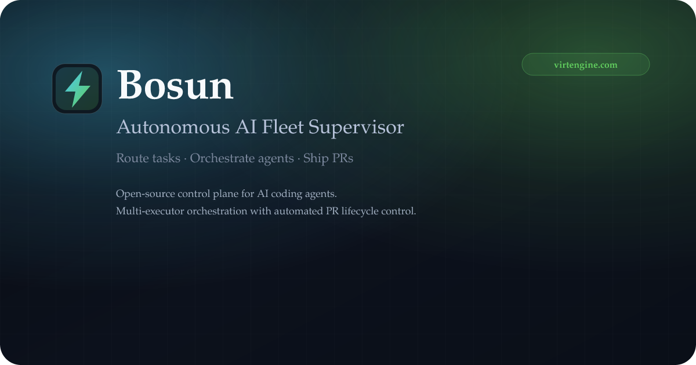

<p align="center">
  
</p>
<h1 align="center">bosun</h1>

Bosun is a production-grade supervisor for AI coding agents. It routes tasks across executors, automates PR lifecycles, and keeps operators in control through Telegram, the Mini App dashboard, and optional WhatsApp notifications.

<p align="center">
  <a href="https://bosun.virtengine.com">Website</a> · <a href="https://bosun.virtengine.com/docs/">Docs</a> · <a href="https://github.com/virtengine/bosun?tab=readme-ov-file#bosun">GitHub</a> · <a href="https://www.npmjs.com/package/bosun">npm</a> · <a href="https://github.com/virtengine/bosun/issues">Issues</a>
</p>

<p align="center">
  
</p>

<p align="center">
  <a href="https://github.com/virtengine/bosun/actions/workflows/ci.yaml"></a>
  <a href="LICENSE"></a>
  <a href="https://www.npmjs.com/package/bosun"></a>
</p>

---

## Quick start

```bash
npm install -g bosun
cd your-repo
bosun
```

First run launches setup automatically. You can also run setup directly:

```bash
bosun --setup
```

Requires:

- Node.js 18+
- Git
- Bash (for `.sh` wrappers) or PowerShell 7+ (for `.ps1` wrappers)
- GitHub CLI (`gh`) recommended

---

## Permanent Mini App Hostname + Fallback Auth

Bosun defaults the Mini App tunnel to **named** mode so the Telegram URL can stay stable (`<user>.<base-domain>`), with quick tunnels only as explicit fallback.

Required Cloudflare settings:

- `CLOUDFLARE_TUNNEL_NAME`
- `CLOUDFLARE_TUNNEL_CREDENTIALS`
- `CLOUDFLARE_BASE_DOMAIN` (for example `bosun.det.io`)
- `CLOUDFLARE_ZONE_ID`
- `CLOUDFLARE_API_TOKEN` (Zone DNS edit scope for the target zone)

Useful optional settings:

- `CLOUDFLARE_TUNNEL_HOSTNAME` (explicit hostname override)
- `CLOUDFLARE_USERNAME_HOSTNAME_POLICY=per-user-fixed`
- `TELEGRAM_UI_ALLOW_QUICK_TUNNEL_FALLBACK=false`

Fallback admin auth (secondary path) is available and stores only Argon2id hash + salt, never plaintext. Use:

- `POST /api/auth/fallback/set` to set/rotate
- `POST /api/auth/fallback/reset` to clear
- `POST /api/auth/fallback/login` to mint normal `ve_session` cookie

---

## What Bosun does

- Routes work across Codex, Copilot, Claude, and OpenCode executors
- Automates retries, failover, and PR lifecycle management
- Auto-labels attached PRs with `bosun-needs-fix` when CI fails (`Build + Tests`)
- Merges passing PRs automatically through the **Bosun PR Watchdog** with a mandatory review gate (prevents destructive merges)
- Persists workflow runs to disk and auto-resumes on restart
- Monitors runs and recovers from stalled or broken states
- Provides Telegram control and a Mini App dashboard
- Integrates with GitHub, Jira, and Vibe-Kanban boards

### Executor quick-start

| Executor          | `primaryAgent` value | Key env vars                                                                          |
| ----------------- | -------------------- | ------------------------------------------------------------------------------------- |
| Codex (OpenAI)    | `codex-sdk`          | `OPENAI_API_KEY`                                                                      |
| Copilot (VS Code) | `copilot-sdk`        | VS Code session                                                                       |
| Claude            | `claude-sdk`         | `ANTHROPIC_API_KEY`                                                                   |
| OpenCode          | `opencode-sdk`       | `OPENCODE_MODEL` (e.g. `anthropic/claude-opus-4-5`), `OPENCODE_PORT` (default `4096`) |

Set `primaryAgent` in `.bosun/bosun.config.json` or choose an executor preset during `bosun --setup`.

---

## Telegram weekly report

- Run `/weekly` to generate the operator weekly agent-work report on demand.
- Use `/report weekly` as an alias.
- Optional scheduler knobs in `.env`: `TELEGRAM_WEEKLY_REPORT_ENABLED`, `TELEGRAM_WEEKLY_REPORT_DAY`, `TELEGRAM_WEEKLY_REPORT_HOUR` (UTC), and `TELEGRAM_WEEKLY_REPORT_DAYS`.

## Documentation

**Published docs (website):** https://bosun.virtengine.com/docs/

**Source docs (markdown):** `_docs/` is the source of truth for long-form documentation. The website should be generated from the same markdown content so docs stay in sync.

Key references:

- [GitHub adapter enhancements](_docs/KANBAN_GITHUB_ENHANCEMENT.md)
- [GitHub Projects v2 index](_docs/GITHUB_PROJECTS_V2_INDEX.md)
- [GitHub Projects v2 quickstart](_docs/GITHUB_PROJECTS_V2_QUICKSTART.md)
- [GitHub Projects v2 API](_docs/GITHUB_PROJECTS_V2_API.md)
- [GitHub Projects v2 monitoring](_docs/GITHUB_PROJECTS_V2_MONITORING.md)
- [GitHub Projects v2 checklist](_docs/GITHUB_PROJECTS_V2_IMPLEMENTATION_CHECKLIST.md)
- [Jira integration](_docs/JIRA_INTEGRATION.md)
- [Workflows](_docs/WORKFLOWS.md)
- [Agent logging quickstart](docs/agent-logging-quickstart.md)
- [Agent logging design](docs/agent-work-logging-design.md)
- [Agent logging summary](docs/AGENT_LOGGING_SUMMARY.md)

---

## CI/CD and quality gates

Bosun enforces a strict quality pipeline in both local hooks and CI:

- **Pre-commit hooks** auto-format and lint staged files.
- **Pre-push hooks** run targeted checks based on changed files (Go, portal, docs).
- **Demo load smoke test** runs in `npm test` and blocks push if `site/indexv2.html` or `site/ui/demo.html` fails to load required assets.
- **Prepublish checks** validate package contents and release readiness.

Local commands you can run any time:

```bash
# Syntax + tests for bosun package
npm test

# Prepublish safety checks
npm run prepublishOnly

# Install local git hooks (pre-commit + pre-push)
npm run hooks:install
```

---

## Repository layout

- `cli.mjs` — entrypoint for the supervisor
- `monitor.mjs` — main orchestration loop
- `config.mjs` — unified config loader
- `ui-server.mjs` — Telegram Mini App backend
- `site/` — marketing + docs website
- `docs/` and `_docs/` — documentation sources (markdown)

---

## License

Apache-2.0

<!-- GitHub Analytics Pixel -->

