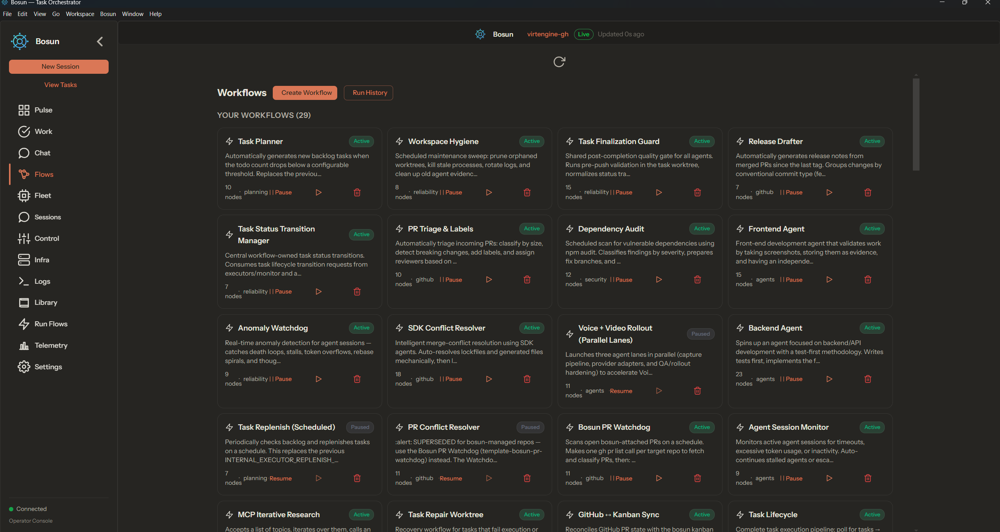

<p align="center">
  
</p>
<h1 align="center">bosun</h1>

Bosun is a production-grade control plane for an autonomous software engineer. It plans and routes work across executors, automates PR lifecycles, and keeps operators in control through Telegram, the Mini App dashboard, and optional WhatsApp notifications.

## Why "Bosun"?

_The name "Bosun" comes from "boatswain", the ship's officer responsible for coordinating deck work, keeping operations moving, and translating command into disciplined execution._

_That maps directly to the Bosun project: it does not replace the captain or crew, it orchestrates the work. Our Bosun plans tasks, routes them to the right executors, enforces operational checks, and keeps humans in control while the system keeps delivery moving. Autonomous engineering with you in control of the operation._

<p align="center">
  <a href="https://bosun.engineer">Website</a> · <a href="https://bosun.engineer/docs/">Docs</a> · <a href="https://github.com/virtengine/bosun?tab=readme-ov-file#bosun">GitHub</a> · <a href="https://www.npmjs.com/package/bosun">npm</a> · <a href="https://hub.docker.com/r/virtengine/bosun">Docker Hub</a> · <a href="https://github.com/virtengine/bosun/issues">Issues</a>
</p>

<p align="center">
  
</p>

<p align="center">
  <a href="https://github.com/virtengine/bosun/actions/workflows/ci.yaml"></a>
  <a href="LICENSE"></a>
  <a href="https://www.npmjs.com/package/bosun"></a>
</p>

---

## Quick start

```bash
npm install -g bosun
cd your-repo
bosun
```

First run launches setup automatically. You can also run setup directly:

```bash
bosun --setup
```

### Docker quick start

Run Bosun with no local Node.js install — pull from Docker Hub:

```bash
docker run -d --name bosun -p 3080:3080 \
  -v bosun-data:/data \
  -e BOSUN_API_KEY=your-secret-key \
  virtengine/bosun:latest
```

Or build from the cloned repo:

```bash
git clone https://github.com/virtengine/bosun.git && cd bosun
docker compose up -d
```

Open `https://localhost:3080` to start the setup wizard.

> **All installation options** — npm, source, Docker Hub, docker-compose, Electron desktop — are documented in [`INSTALL.md`](INSTALL.md) and on [bosun.engineer/docs/installation](https://bosun.engineer/docs/installation.html).

Requires:

- Node.js 22.13+
- Git
- Bash (for `.sh` wrappers) or PowerShell 7+ (for `.ps1` wrappers)
- GitHub CLI (`gh`) recommended

---

## Permanent Mini App Hostname + Fallback Auth

Bosun defaults the Mini App tunnel to **named** mode so the Telegram URL can stay stable (`<user>.<base-domain>`), with quick tunnels only as explicit fallback.

Required Cloudflare settings:

- `CLOUDFLARE_TUNNEL_NAME`
- `CLOUDFLARE_TUNNEL_CREDENTIALS`
- `CLOUDFLARE_BASE_DOMAIN` (for example `bosun.det.io`)
- `CLOUDFLARE_ZONE_ID`
- `CLOUDFLARE_API_TOKEN` (Zone DNS edit scope for the target zone)

Useful optional settings:

- `CLOUDFLARE_TUNNEL_HOSTNAME` (explicit hostname override)
- `CLOUDFLARE_USERNAME_HOSTNAME_POLICY=per-user-fixed`
- `TELEGRAM_UI_ALLOW_QUICK_TUNNEL_FALLBACK=false`

Fallback admin auth (secondary path) is available and stores only Argon2id hash + salt, never plaintext. Use:

- `POST /api/auth/fallback/set` to set/rotate
- `POST /api/auth/fallback/rotate` as explicit rotate alias
- `POST /api/auth/fallback/reset` to clear
- `POST /api/auth/fallback/login` to mint normal `ve_session` cookie

---

## What Bosun does

- Routes work across Codex, Copilot, Claude, and OpenCode executors
- Automates retries, failover, and PR lifecycle management
- Auto-labels attached PRs with `bosun-needs-fix` when CI fails (`Build + Tests`)
- Merges passing PRs automatically through the **Bosun PR Watchdog** with a mandatory review gate (prevents destructive merges)
- Persists workflow runs to disk and auto-resumes on restart
- Monitors runs and recovers from stalled or broken states
- Provides Telegram control and a Mini App dashboard
- Integrates with GitHub and Jira boards

## Autonomous Engineer Workflow Capabilities

Bosun workflows provide a professional, end-to-end execution loop for autonomous delivery:

- Trigger intake: consume issues, comments, schedules, and webhook events
- Planning and decomposition: convert goals into scoped tasks with execution context
- Routed execution: dispatch tasks to the best executor profile with retries and failover
- Quality gates: enforce test/build/review checks before merge decisions
- Recovery and escalation: auto-heal stalled runs, then escalate with clear operator signals

Setup profiles for default workflow behavior:

- Manual Dispatch: human-directed flow with guardrails and review automations
- Balanced (Recommended): daily default with PR quality gates and targeted self-healing
- Autonomous: expanded end-to-end automation for planning, recovery, and maintenance

### Executor quick-start

| Executor          | `primaryAgent` value | Key env vars                                                                          |
| ----------------- | -------------------- | ------------------------------------------------------------------------------------- |
| Codex (OpenAI)    | `codex-sdk`          | `OPENAI_API_KEY`                                                                      |
| Copilot (VS Code) | `copilot-sdk`        | VS Code session                                                                       |
| Claude            | `claude-sdk`         | `ANTHROPIC_API_KEY`                                                                   |
| OpenCode          | `opencode-sdk`       | `OPENCODE_MODEL` (e.g. `anthropic/claude-opus-4-6`), `OPENCODE_PORT` (default `4096`) |

Set `primaryAgent` in `.bosun/bosun.config.json` or choose an executor preset during `bosun --setup`.

## Daemon and sentinel startup

- `bosun --daemon` starts the long-running daemon/monitor.
- `bosun --sentinel` starts only the Telegram sentinel companion process.
- `bosun --daemon --sentinel` starts daemon + sentinel together (recommended for unattended operation).
- `bosun --terminate` is the clean reset command when you suspect stale/ghost processes.

Telegram operators can pull the weekly agent work summary with `/weekly [days]` or `/report weekly [days]`. To post it automatically once per week, set `TELEGRAM_WEEKLY_REPORT_ENABLED=true` together with `TELEGRAM_WEEKLY_REPORT_DAY`, `TELEGRAM_WEEKLY_REPORT_HOUR`, and optional `TELEGRAM_WEEKLY_REPORT_DAYS`.

## Documentation

**Published docs (website):** https://bosun.engineer/docs/

**Source docs (markdown):** `_docs/` is the source of truth for long-form documentation. The website should be generated from the same markdown content so docs stay in sync.

**Product docs and implementation notes:** `docs/` contains focused guides, design notes, and operator-facing references that are kept alongside the codebase.

Key places to start:

- `README.md` - install, setup, and operational overview
- `_docs/WORKFLOWS.md` - workflow system and built-in templates
- `docs/workflows-and-libraries.md` - workflow composition and library behavior
- `docs/agent-logging-quickstart.md` - agent work logging quickstart
- `docs/agent-work-logging-design.md` - logging design and event model

## Troubleshooting

### Preflight warns about an interactive git editor

If preflight reports an interactive git editor such as `code --wait`, `vim`, or `nano`, Bosun can deadlock while Git waits for an editor session to close.

Run this from the repo root to switch the local repo config to a non-interactive editor:

```bash
node git-editor-fix.mjs
```

Preflight checks both `GIT_EDITOR` and `git config --get core.editor`. No warning is shown when `core.editor` is already non-interactive, for example `:`.

---

## CI/CD and quality gates

Bosun enforces a strict quality pipeline in both local hooks and CI:

- **Pre-commit hooks** run syntax checks and warn when staged source files are missing `CLAUDE:SUMMARY` annotations.
- **Pre-push hooks** run targeted checks based on changed files (Go, portal, docs).
- **Demo load smoke test** runs in `npm test` and blocks push if `site/index.html` or `site/ui/demo.html` fails to load required assets.
- **Prepublish checks** validate package contents and release readiness.

### Codebase annotation audit

Use `bosun audit` to generate and validate repo-level annotations that help future agents navigate the codebase without extra runtime context:

```bash
# Coverage report for supported source files
bosun audit scan

# Add missing file summaries and risky-function warnings
bosun audit generate
bosun audit warn

# Rebuild lean manifests and the file responsibility index
bosun audit manifest
bosun audit index
bosun audit trim

# CI-safe conformity gate
bosun audit --ci
```

Notes:

- `bosun audit --ci` exits non-zero on missing summaries, stale warnings, stale `INDEX.map` entries, or credential-like secrets.
- `.githooks/pre-commit` already warns on newly staged files that are missing `CLAUDE:SUMMARY`.
- GitHub Actions can opt into the audit gate by setting the repository variable `BOSUN_AUDIT_CI=1`.

Local commands you can run any time:

```bash
# Syntax + tests for bosun package
npm test

# Annotation conformity gate
npm run audit:ci

# Prepublish safety checks
npm run prepublishOnly

# Install local git hooks (pre-commit + pre-push)
npm run hooks:install
```

---

## Repository layout

- `cli.mjs` — CLI entrypoint for setup, daemon, desktop, and operator commands
- `setup.mjs` — interactive setup flow and config bootstrap
- `infra/` — monitor loop, recovery, lifecycle services, and runtime plumbing
- `workflow/` and `workflow-templates/` — workflow engine, nodes, adapters, and built-in templates
- `task/` — task execution, claims, archiving, and lifecycle ownership
- `server/` — setup server, Mini App backend, and API endpoints
- `ui/` — Mini App frontend assets and operator dashboard modules
- `telegram/` — Telegram bot, sentinel, and channel integrations
- `github/` and `kanban/` — GitHub auth/webhooks and kanban adapters
- `workspace/` — shared workspace registry, context indexing, and worktree lifecycle
- `shell/` and `agent/` — executor integrations, prompts, hooks, and fleet coordination
- `site/` — marketing site and generated docs website assets
- `docs/` and `_docs/` — product docs, deep technical references, and long-form source material
- `tools/` and `tests/` — build utilities, release checks, and regression coverage

If you find this project useful or would like to stay up to date with new releases, a star is appreciated!

## Star History

<a href="https://www.star-history.com/?repos=VirtEngine%2FBosun&type=date&legend=top-left">
 <picture>
   <source media="(prefers-color-scheme: dark)" srcset="https://api.star-history.com/image?repos=VirtEngine/Bosun&type=date&theme=dark&legend=top-left" />
   <source media="(prefers-color-scheme: light)" srcset="https://api.star-history.com/image?repos=VirtEngine/Bosun&type=date&legend=top-left" />
   
 </picture>
</a>
---

## License

Apache-2.0


