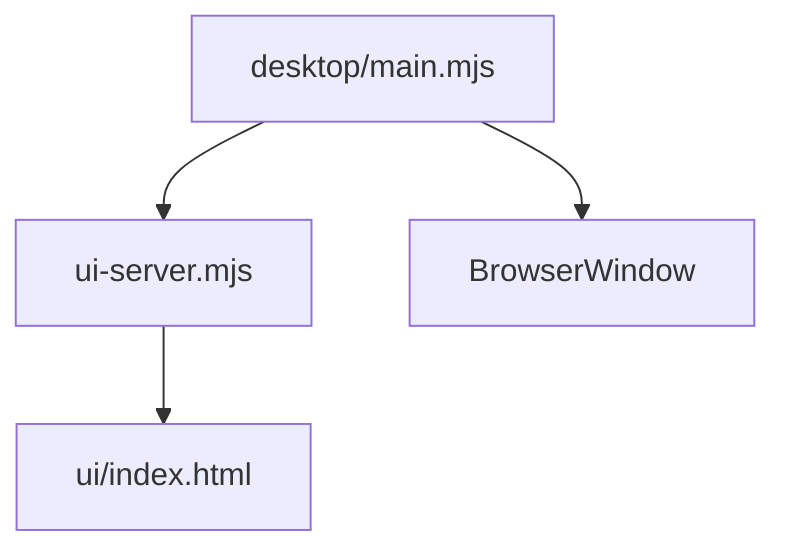

# Bosun Desktop — AGENTS Guide

## Module Overview
- Purpose: Native desktop shell for the Bosun control center, bundling the UI server and opening it in a desktop window.
- Use when: Updating desktop packaging, launch flow, auto-update, or native window behavior.
- Key entry points: `scripts/bosun/desktop/main.mjs:1`, `scripts/bosun/desktop/launch.mjs:1`, `scripts/bosun/ui-server.mjs:1`.

## Architecture
- The desktop app dynamically imports Bosun’s UI server and runs it locally, then loads the UI with a session token.
- Packaged builds copy the `scripts/bosun/` runtime into app resources and start from there.
- Entry points:
  - `main.mjs` starts the UI server and creates the BrowserWindow.
  - `launch.mjs` installs Electron (if needed) and runs the desktop app in dev.



## Core Concepts
- Local UI server: desktop app embeds the same UI server used by the Telegram Mini App.
- Session token: desktop loads `/?token=...` so the UI server sets a session cookie.
- Packaged runtime: `extraResources` copies the Bosun runtime into app resources.

## Usage Examples

### Launch in dev
```bash
node scripts/bosun/desktop/launch.mjs
```

### Build installers
```bash
cd scripts/bosun/desktop
npm install
npm run dist
```

## Implementation Patterns
- Always resolve the Bosun runtime root with `resolveBosunRoot()` when packaged.
- Use dynamic import to load `ui-server.mjs` so packaged resources are used.
- Keep auto-update behind `BOSUN_DESKTOP_AUTO_UPDATE=1` to avoid noisy failures in dev.

## Configuration
- Desktop packaging config lives in `scripts/bosun/desktop/package.json:20`.
- Auto-update is opt-in via `BOSUN_DESKTOP_AUTO_UPDATE=1`.
- Optional update feed override: `BOSUN_DESKTOP_UPDATE_URL`.
- To skip Electron auto-install in dev, set `BOSUN_DESKTOP_SKIP_INSTALL=1`.

## Testing
- Bosun tests: `cd scripts/bosun && npm test`
- Desktop smoke: `node scripts/bosun/desktop/launch.mjs`

## Troubleshooting
- Electron missing
  - Cause: Desktop dependencies not installed.
  - Fix: `npm -C scripts/bosun/desktop install` or set `BOSUN_DESKTOP_SKIP_INSTALL=1` to avoid auto-install.
- UI server fails to start
  - Cause: Port conflict or missing runtime files.
  - Fix: Ensure the packaged `bosun/` runtime exists and retry with a clean start.
